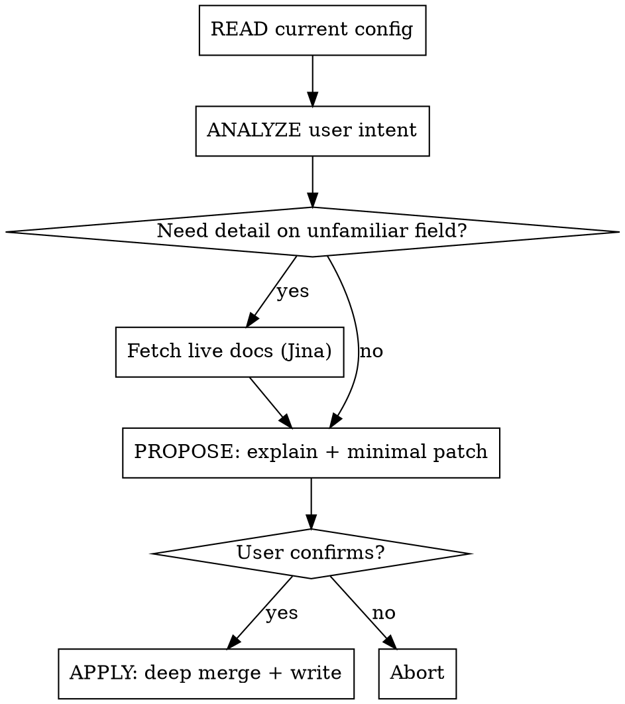

# configure-OpenClaw

## Overview

Safely modify `~/.openclaw/openclaw.json` with minimal, validated patches. OpenClaw uses strict schema validation — unknown fields or malformed values **prevent startup**. Every edit must be correct before writing.

## Safe Edit Process



**Hard Rules — no exceptions:**
- Never write to file before user confirmation
- Never output full config unless user explicitly requests it
- Only change fields the user requested — no bonus edits
- Never guess unknown fields — fetch Jina docs first
- Config changes are hot-reloaded for most sections — no restart needed
- Restart required only for: gateway server settings (port, bind, auth, TLS), infrastructure (discovery, canvasHost, plugins)
- If startup fails after edit, run `openclaw doctor` to diagnose, `openclaw doctor --fix` to auto-repair

## Output Format

Natural language explanation + minimal JSON5 patch (changed fields only):

```
Changing `agents.defaults.model.primary` from "anthropic/claude-sonnet-4-5" to "anthropic/claude-opus-4-6".

// patch
{
  agents: {
    defaults: {
      model: {
        primary: "anthropic/claude-opus-4-6",
      },
    },
  },
}
```

## Live Docs — Fetch When Needed

When the requested field is not in the quick reference below, or you need to validate allowed values:

- **Configuration overview:** `https://r.jina.ai/https://docs.openclaw.ai/gateway/configuration`
- **Field reference:** `https://r.jina.ai/https://docs.openclaw.ai/gateway/configuration-reference`
- **Examples:** `https://r.jina.ai/https://docs.openclaw.ai/gateway/configuration-examples`

## CLI Alternatives

- `openclaw onboard` — full interactive setup
- `openclaw configure` — config wizard
- `openclaw config get/set/unset` — CLI field access
- Control UI at `http://127.0.0.1:18789` Config tab

## Quick Reference

### Format Rules

| Rule | Example |
|------|---------|
| Duration strings | `"30m"` `"1h"` `"24h"` `"30d"` |
| File paths | `"~/.openclaw/workspace"` (`~` supported) |
| Model IDs | `"anthropic/claude-sonnet-4-5"` (must include provider prefix) |
| Phone numbers | `"+15555550123"` (E.164 format, array) |
| JSON5 format | `//` comments and trailing commas supported |
| `$include` | `{ $include: "./agents.json5" }` — include external files, supports arrays for deep-merge |
| Secret refs | `{ source: "env", id: "MY_KEY" }` — for credential fields (env/file/exec) |
| Env substitution | `${VAR_NAME}` in strings; missing vars throw load-time error; escape: `$${VAR}` |

### identity

```json5
{
  identity: {
    name: "Clawd",       // bot display name
    theme: "helpful assistant",
    emoji: "🦞",
  }
}
```

### agents.defaults

```json5
{
  agents: {
    defaults: {
      workspace: "~/.openclaw/workspace",  // required
      model: {
        primary: "anthropic/claude-sonnet-4-5",
        fallbacks: ["anthropic/claude-opus-4-6"],
      },
      imageMaxDimensionPx: 1200,
      timeoutSeconds: 600,
      maxConcurrent: 3,
      thinkingDefault: "low",   // "off" | "low" | "medium" | "high"
      elevatedDefault: "on",    // "on" | "off"
      sandbox: {
        mode: "off",            // "off" | "non-main" | "all"
        scope: "session",       // "session" | "agent" | "shared"
      },
      heartbeat: {
        every: "30m",           // duration string; "0m" disables
        target: "last",         // "last" | "whatsapp" | "telegram" | "discord" | "none"
        directPolicy: "allow",  // "allow" | "block"
      },
    },
    list: [                     // multi-agent setup
      {
        id: "default",
        default: true,
        workspace: "~/.openclaw/workspace",
        groupChat: { mentionPatterns: ["@bot"] },
      },
    ],
  }
}
```

### channels

Supported: WhatsApp, Telegram, Discord, Slack, Signal, iMessage, Google Chat, Mattermost, MS Teams.

```json5
{
  channels: {
    whatsapp: {
      allowFrom: ["+15555550123"],
      dmPolicy: "pairing",        // "pairing" | "allowlist" | "open" | "disabled"
      groupPolicy: "allowlist",   // "pairing" | "allowlist" | "open" | "disabled"
      groups: { "*": { requireMention: true } },
    },
    telegram: {
      enabled: true,
      botToken: "YOUR_TOKEN",
      allowFrom: ["123456789"],
    },
    discord: {
      enabled: true,
      token: "YOUR_TOKEN",
      dm: { enabled: true, allowFrom: ["USER_ID"] },
    },
    slack: {
      enabled: true,
      botToken: "xoxb-...",
      appToken: "xapp-...",
      channels: { "#general": { allow: true, requireMention: true } },
    },
  }
}
```

### auth

```json5
{
  auth: {
    profiles: {
      "anthropic:me": {
        provider: "anthropic",
        mode: "oauth",       // "oauth" | "api_key"
        email: "me@example.com",
      },
    },
    order: {
      anthropic: ["anthropic:me"],
    },
  }
}
```

### models.providers (custom/local models)

```json5
{
  models: {
    mode: "merge",   // "merge" | "replace"
    providers: {
      "lmstudio": {
        baseUrl: "http://127.0.0.1:1234/v1",
        apiKey: "lmstudio",
        api: "openai-responses",
        models: [{
          id: "my-model",
          name: "My Model",
          reasoning: false,
          input: ["text"],
          cost: { input: 0, output: 0, cacheRead: 0, cacheWrite: 0 },
          contextWindow: 128000,
          maxTokens: 8192,
        }],
      },
    },
  }
}
```

### session

```json5
{
  session: {
    dmScope: "per-peer",   // "main" | "per-peer" | "per-channel-peer" | "per-account-channel-peer"
    threadBindings: {
      enabled: true,
      idleHours: 24,
      maxAgeHours: 168,
    },
    reset: {
      mode: "daily",       // "daily" | "idle" | "never"
      atHour: 4,
      idleMinutes: 60,
    },
    resetTriggers: ["/new", "/reset"],
  }
}
```

### gateway

```json5
{
  gateway: {
    port: 18789,
    bind: "loopback",       // IP address or "loopback" | "all"
    auth: {
      token: "your-token",  // token-based auth
    },
    reload: {
      mode: "hybrid",       // "hybrid" | "hot" | "restart" | "off"
      debounceMs: 300,
    },
  }
}
```

Reload modes: `hybrid` = hot-apply safe + auto-restart critical; `hot` = hot-apply only, warns on restart-needed; `restart` = restart on any change; `off` = no file watching.

### tools

```json5
{
  tools: {
    allow: ["exec", "read", "write", "edit"],
    deny: ["browser"],
    elevated: {
      enabled: true,
      allowFrom: {
        whatsapp: ["+15555550123"],
      },
    },
  }
}
```

### cron

```json5
{
  cron: {
    enabled: true,
    maxConcurrentRuns: 2,
    sessionRetention: "7d",   // duration string or false
    runLog: {
      maxBytes: "2mb",
      keepLines: 500,
    },
  }
}
```

### hooks (webhooks)

```json5
{
  hooks: {
    enabled: true,
    token: "shared-secret",
    path: "/hooks",
    defaultSessionKey: "hook-session",
    allowRequestSessionKey: true,
    allowedSessionKeyPrefixes: ["hook-"],
    mappings: [
      {
        match: { path: "/deploy" },
        action: "agent",
        agentId: "default",
        deliver: true,
        allowUnsafeExternalContent: false,
      },
    ],
  }
}
```

### env

```json5
{
  env: {
    vars: { MY_API_KEY: "value" },
    shellEnv: {
      enabled: true,
      timeoutMs: 5000,
    },
  }
}
```

### skills.entries

```json5
{
  skills: {
    allowBundled: ["gemini", "peekaboo"],
    entries: {
      "my-skill": {
        enabled: true,
        apiKey: "KEY_HERE",
        env: { MY_API_KEY: "KEY_HERE" },
      },
    },
  }
}
```

### bindings (multi-agent routing)

```json5
{
  bindings: [
    {
      agentId: "support-bot",
      match: {
        channel: "discord",
        accountId: "USER_ID",
      },
    },
  ],
}
```

## Common Mistakes

| Mistake | Correct approach |
|---------|-----------------|
| Write full config overwriting existing settings | Output patch only, deep merge |
| Use `agent.workspace` | Correct path: `agents.defaults.workspace` |
| Model ID `"claude-sonnet-4-5"` | Must include prefix: `"anthropic/claude-sonnet-4-5"` |
| `allowFrom: "+1555..."` as string | `allowFrom: ["+1555..."]` must be array |
| Write to file before user confirms | Propose patch first, wait for explicit confirmation |
| Guess unknown fields | Fetch Jina docs first, then generate patch |
| Add unknown fields arbitrarily | Schema strictly validated — unknown fields prevent startup |
| Tell user to restart after edit | Config hot-reloads automatically (except gateway/infrastructure) |
| Use `session.scope` | Correct field: `session.dmScope` |
